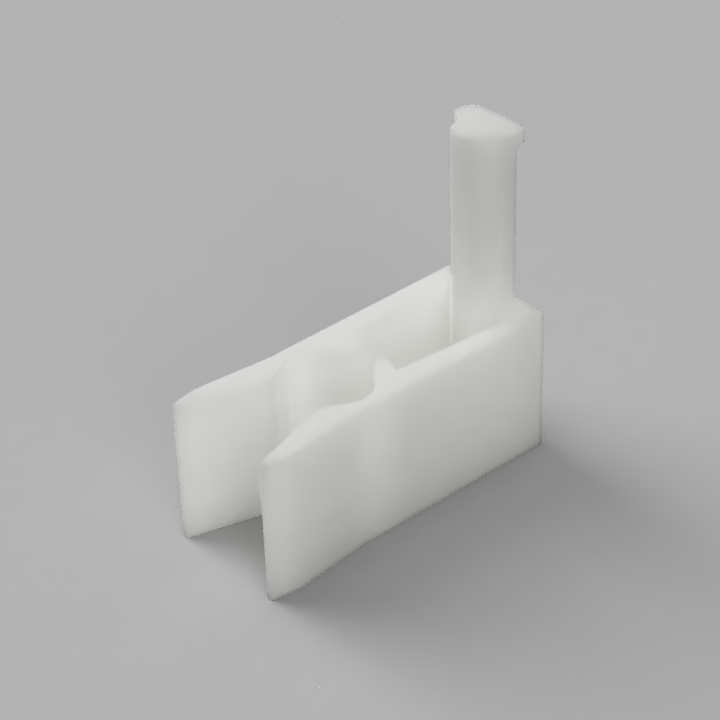
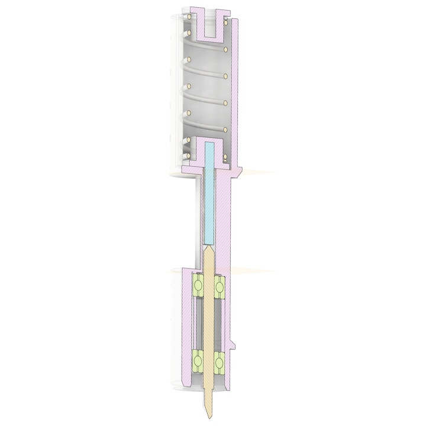
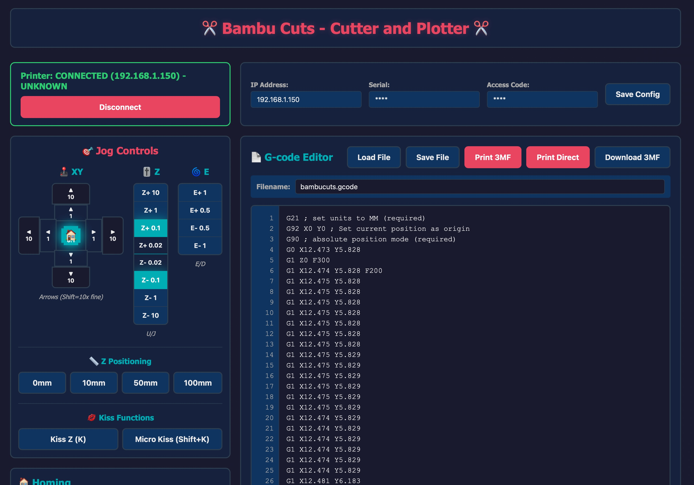

# Bambu Cuts - Cutter and Plotter for Bambu Lab Printers

Control your Bambu Lab 3D printer as a CNC cutter or plotter. Convert SVG/DXF files to G-code and execute them with a web-based control interface.


# WARNING

This can brake your printer, or you, or your cat, or all of the above. Especially if you put a knife on your printer. Using this software there will be no hard limits of the printer movements, make sure your gcode is reasonable. 


The origin of the print is at the current tool head position for X and Y. 
The Z=0 is set with the jogger, always make sure the Z is correctly zeroes. Otherwise it can plunge the knife into the print bed.

The printer needs to be in LAN mode with developer options enabled, or run an older firmware (1.0.4 worked for me)

## Demo


*ploting on fabric*


*cutting a sticker with a drag knife*





*3D printed pen holder for plotting operations*


## Assembling the cutter 



Parts: 
 - 2mm ID 6mm OD 3mm deep bearing 2x. https://amzn.to/46W4Ju7
 - roland style 2mm shaft blades https://amzn.to/4gY9w2Q 
 - 7mm OD, 20mm long spring https://amzn.to/4mQEISK
 - 1.7mm diameter 13mm long steel rod. (I cut a nail to size)


 The cutter assembly fits in the place of the hot end. Insert to a piece of filament to control the spring tension with the extruder.


## Features




- 🎮 **Web-based Control Interface** - Jog controls, G-code editor, and live monitoring
- ✂️ **SVG/DXF to G-code Conversion** - Convert vector graphics to cutting paths


*Detailed cross-section view of the cutter mechanism*
- 🖥️ **CLI Tools** - Command-line utilities for batch processing


*3D printed pen holder for plotting operations*
- 🔄 **3MF Integration** - Automatically packages G-code for Bambu Lab printers

## Installation

### From Source

```bash
git clone git@github.com:unrelatedlabs/bambu-cuts.git
cd bambu-cuts
pip install -e .
```

## Quick Start

### Option 1: Run Without Installing (Development)

**Quick Start (Linux/Mac):**
```bash
./run.sh
```

**Manual Setup:**
```bash
# Create and activate virtual environment
python3 -m venv .venv
source .venv/bin/activate  # On Windows: .venv\Scripts\activate

# Install dependencies
pip install -r requirements.txt

# Run the server directly
python -m bambucuts.webui.app
```

Open http://localhost:5425 in your browser.

### Option 2: Run with Docker

```bash
# Build the Docker image
docker build -t bambucuts .

# Run the container (interactive for first-time config)
docker run -it -p 5425:5425 bambucuts

# Or run with existing config (non-interactive)
docker run -p 5425:5425 -v ~/.bambucuts.conf:/root/.bambucuts.conf bambucuts
```

**Note:** Use `-it` flag on first run to interactively enter printer configuration. After configuration is saved, you can mount the config file with `-v` flag for subsequent runs.

Open http://localhost:5425 in your browser.

### Option 3: Install and Use CLI

After installation with `pip install -e .`:

```bash
bambucuts server
```

On first run, you'll be prompted for your printer configuration. Configuration is saved to `~/.bambucuts.conf`

Open http://localhost:5425 in your browser.

### 3. Convert SVG to G-code

```bash
bambucuts svg2gcode input.svg -o output.gcode
```

### 4. Convert DXF to SVG

```bash
bambucuts dxf2svg input.dxf -o output.svg
```

## CLI Commands

- `bambucuts server` - Start web interface
- `bambucuts svg2gcode INPUT` - Convert SVG to G-code
- `bambucuts dxf2svg INPUT` - Convert DXF to SVG

Run `bambucuts --help` for full options.

## My process 

- Create SVG in Inkscape
- create gcode in Kiri:Moto https://grid.space/kiri/  The machine settings for Kiri:Moto are at examples/kirimoto_settings.- I check my gcode with https://ncviewer.com
- In the webui set Z=0 with the jogger
- Move the print head to where the bottom left of the image is supposed to start.
- Load gcode in webui 
- Print 3mf


## License

### Code License

This software is licensed under the **GNU General Public License v3.0 or later (GPL-3.0-or-later)**.

See [License.txt](License.txt) for the full license text.

You are free to use, modify, and distribute this software under the terms of the GPL-3.0 license.

### 3D Files License

All 3D model files (.3mf, .stl, .obj, etc.) in this repository are licensed under the **Creative Commons Attribution-NonCommercial 4.0 International (CC BY-NC 4.0)**.

See [LICENSE-3D-FILES.txt](LICENSE-3D-FILES.txt) for the full license text.

- ✅ You may share and adapt the 3D files
- ✅ You must give appropriate credit
- ❌ You may not use the 3D files for commercial purposes
